# nifpga-fifo-to-zmq
A RUST program that read data from an NI FPGA FIFO and send the data to via ZMQ PULL as fast as possible.
The ZMQ interface allow to read the FIFO data in other "slower" program such as a Python script even for high-bandwidth dataflux.

### Getting started
Example:
```
nifpga-fifo-to-zmq -s 6AD321BBEEEEEEFFFFFFFCD9205CEEEB -r false -n RIO0 -f 2 -p 12345 --fifo-reading-buffer 10000 --dma-buffer-size 500000 -m 2 C:\bitfiles\MyBitfile.lvbitx
```
Usage:

```
Usage: nifpga-fifo-to-zmq.exe [OPTIONS] [BIT_FILE]

Arguments:
  [BIT_FILE]  Set the bit_file name
Options:
  -s, --signature <SIGNATURE>       Sets a custom config file [default: ]
  -n, --ni-address <NI_ADDR>        Turn debugging information on [default: RIO0]
  -r, --run <false>                 [default: false] [possible values: true, false]
  -c, --close-on-reset <false>      [default: false] [possible values: true, false]
  -f, --fifo <0>                    [default: 0]
      --dma-buffer-size <50000>     [default: 50000]
      --fifo-reading-buffer <5000>  [default: 5000]
  -p, --port <13123>                [default: 13123]
  -m, --min-packet <1>              [default: 1]
  -h, --help                        Print help
  -V, --version                     Print version
```
### How it works inside?



## FAQ ##

### Why `cargo build` give a linker error: `note: LINK : fatal error LNK1181: cannot open input file NiFpga.lib`? ###

The nifpga-rs compilation needs both `NiFpga.lib` and `NiFpga.dll`. Unfortunatly, to my knowledge NI distributes with LabView only the dymamic library `NiFpga.dll` and but it does not provide the static library `NiFpga.lib`.

You can find `nifpga.dll` on `C:\Windows\SysWOW64` or `C:\Windows\System32`. 
The `nifpga.lib` can be generated starting from the `nifpga.dll` by the following steps.

Create a folder and copy there `nifpga.dll` file. Then from the Visual Studio developer Powershell open `cmd.exe`

```
cmd
cd C:\THEFOLDER
```

then go in the folder where you have copied `nifpga.dll`

```
echo LIBRARY NIFPGA > nifpga.def
echo EXPORTS >> nifpga.def
for /f "skip=19 tokens=4" %A in ('dumpbin /exports nifpga.dll') do echo %A >> nifpga.def
```

once the process is done

```
lib /def:nifpga.def /out:nifpga.lib /machine:x64
```

Now you can copy the `nifpga.lib` to the rust project folder and be able to compile it.


### Where I can find the `signature` of my FPGA bit file? ###

The NI FPGA `.lvbitx` files are XML text files.
The `signature` that you need to open the FPGA Session you can find in the  `.lvbitx` file by searching for `<SignatureRegister>`.
